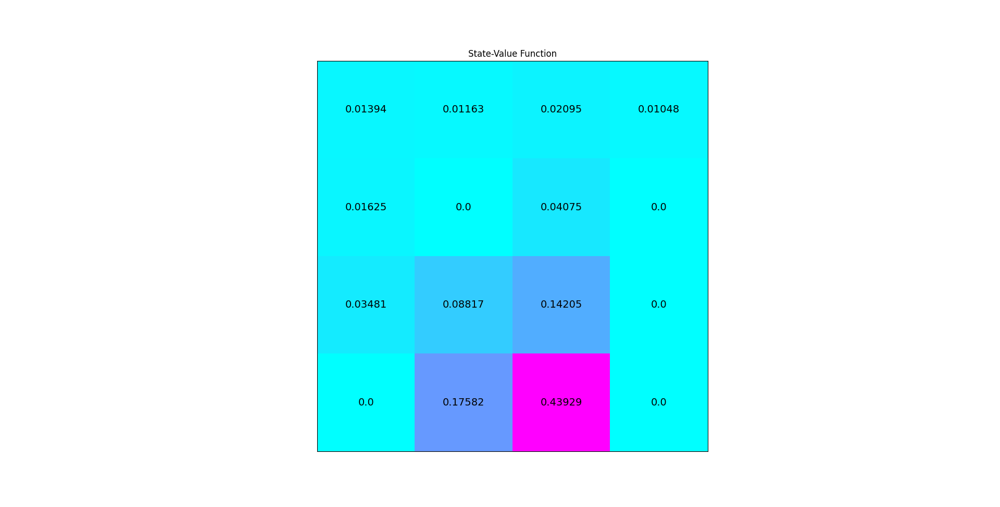

## rl-python

Implementation of reinforcement learning algorithms. Algorithms have been refactored/reimplemented
from various resources such as:

- <a href="https://github.com/udacity/deep-reinforcement-learning">Udacity DRL repository</a>
- <a href="https://livevideo.manning.com/module/56_8_7/reinforcement-learning-in-motion/">Reinforcement learning in motion</a>


### Acknowledgements

The inital version of the simulator is taken from https://github.com/nmccrea/sobot-rimulator (thanks a lot). 

## Dependencies

- OpenAI Gym
- PyTorch
- NumPy


## Examples

### Dynamic programming

- <a href="src/examples/dp/iterative_policy_evaluation_frozen_lake.py">Iterative policy evaluation on FrozenLake-v0</a>
- <a href="src/examples/dp/policy_improvement_frozen_lake.py">Policy improvement on FrozenLake-v0</a>
- <a href="src/examples/dp/policy_iteration_frozen_lake.py">Policy iteration on FrozenLake-v0</a>
- <a href="src/examples/dp/value_iteration_frozen_lake.py">Value iteration on FrozenLake-v0</a>

### Monte Carlo

- <a href="src/examples/mc/mc_prediction_black_jack.py">Monte Carlo prediction on ```Blackjack-v0```</a>
- <a href="src/examples/mc/mountain_car_approximate_monte_carlo.py">Approximate Monte Carlo on ```MountainCar-v0```</a>
- <a href="src/examples/mc/mc_tree_search_taxi_v3.py.py">Monte Carlo tree search ```Taxi-v3```</a>


### Temporal differencing

- <a href="src/examples/td/cliff_walking_q_learning.py">TD(0) on ```CartPole-v0```</a> 
- <a href="src/examples/td/cliff_walking_q_learning.py">SARSA on ```Cliffwalking-v0```</a> 
- <a href="src/examples/td/cliff_walking_q_learning.py">Q-learning on ```Cliffwalking-v0``` </a> 
- <a href="#">Expected SARSA  </a> (TODO)
- <a href="#">SARSA lambda  </a> (TODO)
- <a href="src/examples/td/td_zero_semi_gradient_mountain_car.py">TD(0) semi-gradient on ```MountainCar-v0```</a>
- <a href="src/examples/td/sarsa_semi_gradient_mountain_car_v0.py">SARSA semi-gradient on ```MountainCar-v0```</a>
- <a href="src/examples/td/q_learning_moutain_car_v0.py">Q-learning on ```MountainCar-v0```</a>

### DQN

- <a href="src/examples/dqn/dqn_lunar_lander.py">Vanilla DQN on ```CartPole-v0```</a>
- <a href="src/examples/dqn/dqn_lunar_lander.py">Vanilla DQN on LunarLander-v2</a>


### Policy gradient methods

- <a href="src/examples/pg/reinforce_cart_pole.py">REINFORCE on ```CartPole-v0```</a>


## Images


**Approximate Monte Carlo on Mountain Car**


**Iterative policy evaluation on FrozenLake**


**Q-learning on Cliffwalking**


 


