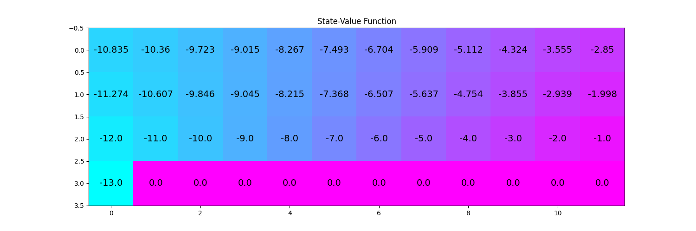

## rl-python

Implementation of reinforcement learning algorithms. Algorithms have been refactored/reimplemented
from various resources such as:

- <a href="https://github.com/udacity/deep-reinforcement-learning">Udacity DRL repository</a>

## Dependencies

- OpenAI Gym
- PyTorch
- NumPy

## Examples

### Dynamic programming

- <a href="apps/dp/iterative_policy_evaluation_frozen_lake.py">Iterative policy evaluation on FrozenLake-v0</a>
- <a href="apps/dp/policy_improvement_frozen_lake.py">Policy improvement on FrozenLake-v0</a>
- <a href="apps/dp/policy_iteration_frozen_lake.py">Policy iteration on FrozenLake-v0</a>
- <a href="apps/dp/value_iteration_frozen_lake.py">Value iteration on FrozenLake-v0</a>

### Monte Carlo

- <a href="apps/mc_prediction_black_jack.py">Monte Carlo prediction on Blackjack-v0</a>

### Temporal differencing

- <a href="apps/td/cliff_walking_q_learning.py">SARSA on Cliffwalking </a> 
- <a href="apps/td/cliff_walking_q_learning.py">Q-learning on Cliffwalking  </a> 
- <a href="#">Expected SARSA  </a> 

### DQN

- <a href="apps/dqn_lunar_lander.py">Vanilla DQN on CartPole-v2</a>
- <a href="apps/dqn_lunar_lander.py">Vanilla DQN on LunarLander-v2</a>

## Images

 <figure>
  
  <figcaption>Iterative policy evaluation on FrozenLake.</figcaption>
</figure> 

 <figure>
  
  <figcaption>Q-learning on Cliffwalking .</figcaption>
</figure> 

