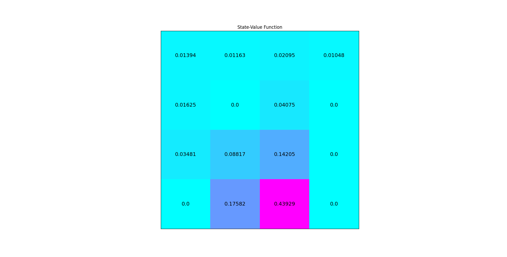

Iterative policy evaluation on ``FrozenLake-v0`` (Python)
=========================================================

In this example, we use the iterative policy iteration algorithm to train an
agent on the ``FrozenLake-v0`` environment. In ``PyCubeAI`` there is a
tabular implementation of the algorithm implemented in the ``IterativePolicyEvaluator`` class.

Imports needed to run the example.

.. code-block::  

	import gym
	import numpy as np
	import matplotlib.pyplot as plt
	from src.algorithms.dp.iterative_policy_evaluation import IterativePolicyEvaluator, DPAlgoConfig
	from src.policies.uniform_policy import UniformPolicy
	from src.algorithms.rl_serial_agent_trainer import RLSerialTrainerConfig, RLSerialAgentTrainer
	from src.worlds.world_helpers import n_states, n_actions

Next we implement a helper function for plotting the value function

.. code-block::

	def plot_values(v: np.array) -> None:
	    
	    # reshape value function
	    V_sq = np.reshape(v, (4, 4))

	    # plot the state-value function
	    fig = plt.figure(figsize=(6, 6))
	    ax = fig.add_subplot(111)
	    im = ax.imshow(V_sq, cmap='cool')
	    for (j, i), label in np.ndenumerate(V_sq):
		ax.text(i, j, np.round(label, 5), ha='center', va='center', fontsize=14)
	    plt.tick_params(bottom=False, left=False, labelbottom=False, labelleft=False)
	    plt.title('State-Value Function')
	    plt.show()
	
Finally, we put everything together. The driver starts with a ``UniformPolicy`` instance which
we initalize with the number of states and actions of the environment. 
    
.. code-block::

	if __name__ == '__main__':

	    env = gym.make("FrozenLake-v0")

	    policy_init = UniformPolicy(n_actions=n_actions(env),  n_states=n_states(env))

	    agent_config = DPAlgoConfig()
	    agent_config.gamma = 1.0
	    agent_config.tolerance = 1.0e-8
	    agent_config.policy = policy_init

	    agent = IterativePolicyEvaluator(agent_config)

	    config = RLSerialTrainerConfig()
	    config.n_episodes = 100

	    trainer = RLSerialAgentTrainer(agent=agent, config=config)

	    ctrl_res = trainer.train(env)

	    print(f"Converged {ctrl_res.converged}")
	    print(f"Number of iterations {ctrl_res.n_itrs}")
	    print(f"Residual {ctrl_res.residual}")

	    plot_values(agent.v)
	    	    
Running the driver code above produces the following output

.. code-block::

	INFO: Episode 0 of 100, (1.0% done)
	INFO: Episode 10 of 100, (11.0% done)
	INFO: Episode 20 of 100, (21.0% done)
	INFO: Episode 30 of 100, (31.0% done)
	INFO: Episode 40 of 100, (41.0% done)
	INFO: Episode 50 of 100, (51.0% done)
	INFO: On Episode 56 the break training flag was set. Stop training
	INFO Done. Execution time 0.013857874000677839 secs
	Converged True
	Number of iterations 57
	Residual 1e-10
	
The image below shown the value function produced

