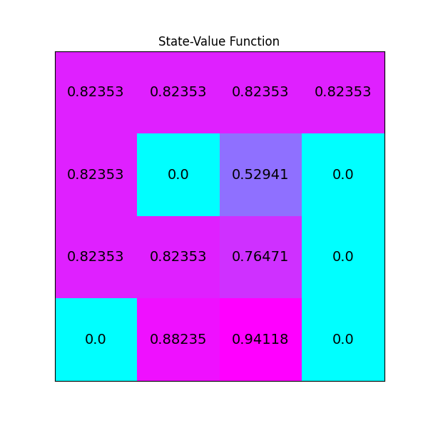

Value iteration on ``FrozenLake-v0``
====================================

In this example, we use the value iteration algorithm to train an
agent on the ``FrozenLake-v0`` environment. In ``PyCubeAI`` there is a
tabular implementation of the algorithm implemented in the ``ValueIteration`` class.

Imports needed to run the example.

.. code-block::  

	import gym
	import numpy as np
	import matplotlib.pyplot as plt

	from src.algorithms.dp.value_iteration import ValueIteration, DPAlgoConfig
	from src.algorithms.rl_serial_agent_trainer import RLSerialTrainerConfig, RLSerialAgentTrainer
	from src.policies.uniform_policy import UniformPolicy
	from src.policies.max_action_equal_probability_stochastic_policy_adaptor import MaxActionEqualProbabilityAdaptorPolicy
	from src.worlds.world_helpers import n_states, n_actions

Next we implement a helper function for plotting the value function

.. code-block::

	def plot_values(v: np.array) -> None:
	    
	    # reshape value function
	    V_sq = np.reshape(v, (4, 4))

	    # plot the state-value function
	    fig = plt.figure(figsize=(6, 6))
	    ax = fig.add_subplot(111)
	    im = ax.imshow(V_sq, cmap='cool')
	    for (j, i), label in np.ndenumerate(V_sq):
		ax.text(i, j, np.round(label, 5), ha='center', va='center', fontsize=14)
	    plt.tick_params(bottom=False, left=False, labelbottom=False, labelleft=False)
	    plt.title('State-Value Function')
	    plt.show()
	
Finally, we put everything together. The driver starts with a ``UniformPolicy`` instance which
we initalize with the number of states and actions of the environment. 
    
.. code-block::

	if __name__ == '__main__':

	    	ENV_NAME = "FrozenLake-v0"
    		GAMMA = 1.0

    		env = gym.make(ENV_NAME)
    		policy_init = UniformPolicy(n_actions=n_actions(env),
                                           n_states=n_states(env), init_val=None)
                                           
    		policy_adaptor = MaxActionEqualProbabilityAdaptorPolicy()

    		agent_config = DPAlgoConfig(gamma=GAMMA, tolerance=1.0e-10, policy=policy_init)

    		agent = ValueIteration(agent_config, policy_adaptor)

    		trainer_config = RLSerialTrainerConfig(n_episodes=1000,
                                                       tolerance=1.0e-10, output_msg_frequency=100)

    		trainer = RLSerialAgentTrainer(config=trainer_config, agent=agent)
    		ctrl_res = trainer.train(env)

    		print(f"Converged {ctrl_res.converged}")
    		print(f"Number of iterations {ctrl_res.n_itrs}")
    		print(f"Residual {ctrl_res.residual}")

    		print("\nOptimal Policy (LEFT = 0, DOWN = 1, RIGHT = 2, UP = 3):")
    		print(agent.policy.policy, "\n")

    		plot_values(agent.v)
	    	    
Running the driver code above produces the following output

.. code-block::

	INFO: Episode 0 of 1000, (0.1% done)
	INFO Done. Execution time 0.0010964580005747848 secs
	INFO Done. Execution time 0.0009977879999496508 secs
	INFO Done. Execution time 0.00101123800050118 secs
	INFO Done. Execution time 0.000928472999476071 secs
	INFO Done. Execution time 0.0008954209997682483 secs
	INFO Done. Execution time 0.0008632760000182316 secs
	INFO Done. Execution time 0.0008822680001685512 secs
	INFO Done. Execution time 0.0009741799995026668 secs
	...
	INFO Done. Execution time 0.6396229520005363 secs
	Converged True
	Number of iterations 591
	Residual 1e-12

	Optimal Policy (LEFT = 0, DOWN = 1, RIGHT = 2, UP = 3):
	[[1.   0.   0.   0.  ]
 	 [0.   0.   0.   1.  ]
 	 [0.   0.   0.   1.  ]
 	 [0.   0.   0.   1.  ]
 	 [1.   0.   0.   0.  ]
 	 [0.25 0.25 0.25 0.25]
 	 [0.5  0.   0.5  0.  ]
 	 [0.25 0.25 0.25 0.25]
 	 [0.   0.   0.   1.  ]
 	 [0.   1.   0.   0.  ]
 	 [1.   0.   0.   0.  ]
 	 [0.25 0.25 0.25 0.25]
 	 [0.25 0.25 0.25 0.25]
 	 [0.   0.   1.   0.  ]
 	 [0.   1.   0.   0.  ]
 	 [0.25 0.25 0.25 0.25]] 
	
The image below shown the value function produced

