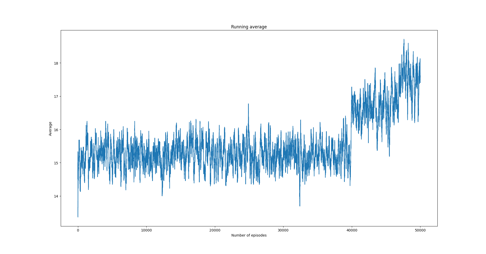

SARSA algorithm on ``CartPole-v0`` (Python)
===========================================

Overview
--------

SARSA algorithm on CartPole-v0 environment. Since the environment
has a continuous state vector we perform state aggregation

Code
----

.. code-block::

	import matplotlib.pyplot as plt
	import numpy as np

	from src.algorithms.td.td_algorithm_base import TDAlgoConfig
	from src.algorithms.td.sarsa import Sarsa
	from src.worlds.state_aggregation_cart_pole_env import StateAggregationCartPoleEnv
	from src.policies.epsilon_greedy_policy import EpsilonGreedyPolicy, EpsilonDecayOption
	from src.trainers.rl_serial_algorithm_trainer import RLSerialTrainerConfig, RLSerialAgentTrainer
	
	Env = TypeVar('Env')

.. code-block::

	def plot_running_avg(avg_rewards):

	    running_avg = np.empty(avg_rewards.shape[0])
	    for t in range(avg_rewards.shape[0]):
		running_avg[t] = np.mean(avg_rewards[max(0, t-100) : (t+1)])
	    plt.plot(running_avg)
	    plt.xlabel("Number of episodes")
	    plt.ylabel("Average")
	    plt.title("Running average")
	    plt.show()

.. code-block::

	class CartPoleV0SARSA(Sarsa):

	    def __init__(self, config: TDAlgoConfig):
		super(CartPoleV0SARSA, self).__init__(algo_config=config)

	    def actions_before_training_begins(self, env: Env, **options) -> None:
		
		super(CartPoleV0SARSA, self).actions_before_training_begins(env, **options)

		# initialize properly the state

		for state in env.state_space:
		    for action in range(env.n_actions):
		        self.q_table[state, action] = 0.0

.. code-block::

	if __name__ == '__main__':

	    GAMMA = 1.0
	    ALPHA = 0.1
	    EPS = 1.0
	    env = StateAggregationCartPoleEnv(n_states=10) #, state_var_idx=4)

	    sarsa_config = TDAlgoConfig(gamma=GAMMA, alpha=ALPHA, policy=EpsilonGreedyPolicy(n_actions=env.n_actions, eps=EPS,
		                                  decay_op=EpsilonDecayOption.INVERSE_STEP,
		                                  min_eps=0.001),
		                    n_episodes=50000, n_itrs_per_episode=500)

	    sarsa = CartPoleV0SARSA(config=sarsa_config)

	    rl_trainer_config = RLSerialTrainerConfig(n_episodes=50000, output_msg_frequency=100)
	    trainer = RLSerialAgentTrainer(algorithm=sarsa, config=rl_trainer_config)

	    trainer.train(env)

	    # plot average reward per episode
	    avg_reward = trainer.avg_rewards

	    plt.plot(trainer.rewards)
	    plt.xlabel("Episode")
	    plt.ylabel("Average reward")
	    plt.title("Average reward per episode")
	    plt.show()

	    plot_running_avg(avg_rewards=np.array(trainer.rewards))
	    
Results
-------

   Running reward average. 
