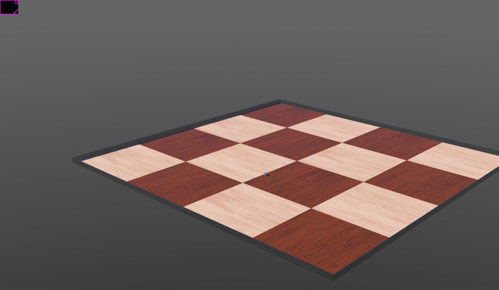
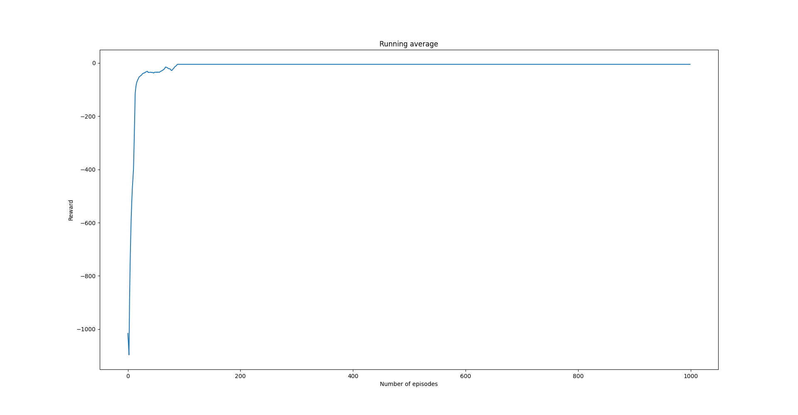

Simple Q-learning based controller for ``epuck`` robot
======================================================

.. autosummary::

In this example, we try to train a Q-learning based agent that controls a robot so that it moves 
on a straight line. Specifically, we simulate the `epuck <https://cyberbotics.com/doc/guide/epuck#e-puck-model>`_ robot from the Webots library.
The world is a simple rectangular grid shown in the image below

There are two actions available, ``MOVE_FWD`` and ``STOP``. The agent begins at position ``(0, 0, 0)`` which is the
center of the grid. The goal is to move the robot at [-2.5, 0.0] and stop there. 

The controller, we will develop in this example, is very simple. Ideally, we would like to 
monitor some aspect of the robot e.g. the speed input to the motors. However, the controller in this
example will simply select actions to be executed. The result of this, is that our robot
may drift during the simulation. However, since the action space is really small and we limit
the mumber of simulation episodes to a small number, this drift will not be be signigicant. We will address these
points in a later example.

Recall, that the vanilla Q-learning algorithm, uses a table tp represent the state-action value function.
Thus, we will digitize the grid environment using ten points in every direction. This is done in the 
``EnvironmentWrapper`` class. 

Let's go over the code. As usual, we start with the needed imports

.. code-block::  

	import numpy as np
	from pathlib import Path
	import matplotlib.pyplot as plt

	from controller import Supervisor, Node

	from src.worlds.webot_environment_wrapper import EnvironmentWrapper, EnvConfig
	from src.worlds.state_aggregation_webot_env import StateAggregationWebotEnv, StateAggregationWebotEnvBoundaries
	from src.worlds.webot_robot_action_space import WebotRobotActionType, WebotRobotActionBase, \
	    WebotRobotMoveFWDAction, WebotRobotStopAction

	from src.agents.diff_drive_robot_qlearner import DiffDriveRobotQLearner
	from src.algorithms.td.td_algorithm_base import TDAlgoInput
	from src.policies import EpsilonGreedyPolicy, EpsilonDecayOption
	from src.utils import INFO
	
Next we define constants that control the program execution

.. code-block::

	# Define a variable that defines the duration of each physics step.
	# This macro will be used as argument to the Robot::step function,
	# and it will also be used to enable the devices.
	# This duration is specified in milliseconds and it must
	# be a multiple of the value in the basicTimeStep field of the WorldInfo node.
	TIME_STEP = 32

	MAX_SPEED = 6.28
	MIN_SPEED = 0.0

	# threshold value for the proximity sensors
	# to identify the fact that the robot crushed the wall
	BUMP_THESHOLD = 90
	N_EPISODES = 1000
	PLOT_STEP = 10
	N_ITRS_PER_EPISODE = 2000
	EPS = 1.0
	EPS_DECAY_OP = EpsilonDecayOption.INVERSE_STEP
	ALPHA = 0.1
	GAMMA = 0.99 

Next, we define a function that allows us to plot a running
mean of the gained rewards 

.. code-block::  

	def plot_running_avg(avg_rewards, step):

	    running_avg = np.empty(avg_rewards.shape[0])
	    for t in range(avg_rewards.shape[0]):
		running_avg[t] = np.mean(avg_rewards[max(0, t - step): (t + 1)])
	    plt.plot(running_avg)
	    plt.xlabel("Number of episodes")
	    plt.ylabel("Reward")
	    plt.title("Running average")
	    plt.show()

The ``Policy`` class represents a simple policy strategy we will follow. Observe, that when at 
state ``(5, 5)`` i.e. the center of the grid, we always select ``MOVE_FWD`` action

.. code-block:: 

	class Policy(EpsilonGreedyPolicy):
    		def __init__(self, n_actions: int) -> None:
        		super(Policy, self).__init__(eps=EPS, decay_op=EPS_DECAY_OP, n_actions=n_actions)

    		def __call__(self, q_func, state) -> int:

			# if we are at the origin always choose FWD
			if state == (5, 5):
			    return 1

        		return super(Policy, self).__call__(q_func, state)

		def select_action(self, q_func, state) -> int:
			# if we are at the origin always choose FWD
			if state == (5, 5):
			    return 1

        		return super(Policy, self).max_action(q_func, state=state, n_actions=self.n_actions)

The ``OnGoal`` class deals with rewards assignement. It checks whether the robot reached the goal position
and which action has been chosen.

.. code-block::

	class OnGoal(object):

    		def __init__(self, goal_position: list) -> None:

			# radius away from the goal
			self.goal_radius: float = 0.1
			self.robot_radius = 7.4 / 100.0
			self.goal_position = np.array(goal_position)
			self.start_position = np.array([0., 0., 0., ])

    		def check(self, robot_node: Node, action: WebotRobotActionBase) -> tuple:

			position = robot_node.getPosition()
			position = np.array(position)

			# compute l2 norm from goal
			l2_norm = np.linalg.norm(position - self.start_position)

			# we don't want to be stacked where we started
			# we want to make progress. If we are at the
			# start position and decide to STOP then exit the game
			if l2_norm < 1.0e-4 and action.action_type == WebotRobotActionType.STOP:
			    return True, -2.0, l2_norm

			# compute l2 norm from goal
			l2_norm = np.linalg.norm(position - self.goal_position)

			if l2_norm < self.goal_radius:

			    # we reached the goal but we also want
			    # the robot to stop

			    if action.action_type == WebotRobotActionType.STOP:
				return True, 10.0, l2_norm
			    else:
				# otherwise punish the agent
				return False, -2.0, l2_norm

			# goal has not been reached. No reason to stop
			# so penalize this choice
			if action.action_type == WebotRobotActionType.STOP:
			    return False, -2.0, l2_norm

        		return False, 0.0, l2_norm
	
Finally, the ``controller_main`` function puts everything together. We need a ``Supervisor`` Webot Node so that
we can reset the environment. We obtain the robot node using the ``supervisor.getFromDef(name='qlearn_e_puck')`` function.
    
.. code-block::

	def controller_main():

	    	# number of steps to play
	    	supervisor = Supervisor()

	    	robot_node = supervisor.getFromDef(name='qlearn_e_puck')

    		if robot_node is None:
        		raise ValueError("Robot node is None")

    		robot_node.enablePoseTracking(TIME_STEP)

    		goal_position = [0.0, 0.0, -2.5]
    		on_goal_criterion = OnGoal(goal_position=goal_position)

		robot = supervisor
		env_config = EnvConfig()
		env_config.dt = TIME_STEP
		env_config.robot_name = "qlearn_e_puck"
		env_config.bump_threshold = BUMP_THESHOLD
		env_config.on_goal_criterion = on_goal_criterion
		env_config.reward_on_wall_crush = -5.0
		environment = EnvironmentWrapper(robot=robot, robot_node=robot_node, config=env_config)

    		environment.add_action(action=WebotRobotStopAction())
    		environment.add_action(action=WebotRobotMoveFWDAction(motor_speed=MAX_SPEED))

    		# position aggregation environment
    		boundaries = StateAggregationWebotEnvBoundaries(xcoords=(-3.0, 3.0),
                                                    		ycoords=(-3.0, 3.0))

    		state_aggregation_env = StateAggregationWebotEnv(env=environment,
                                                     boundaries=boundaries, states=(10, 10))

    		agent_config = TDAlgoInput()
    		agent_config.n_episodes = N_EPISODES
    		agent_config.n_itrs_per_episode = N_ITRS_PER_EPISODE
    		agent_config.gamma = GAMMA
    		agent_config.alpha = ALPHA
    		agent_config.output_freq = 1
    		agent_config.train_env = state_aggregation_env
    		agent_config.policy = Policy(n_actions=state_aggregation_env.n_actions)

    		agent = DiffDriveRobotQLearner(algo_in=agent_config)
    		agent.train()

    		agent.save_q_function(filename=Path("q_learner.json"))
    		plot_running_avg(agent.total_rewards, step=PLOT_STEP)

    		print("{0} Finished training".format(INFO))
    		# once the agent is trained let's play
    		agent.training_finished = True
    		agent.load_q_function(filename=Path("q_learner.json"))
    		agent.play(env=state_aggregation_env, n_games=1)
	    	    

.. code-block::

	if __name__ == '__main__':

    		controller_main()

In order to run this example, we will need to launch the environment on Webots.	
Running the driver code above produces the following running average rewards 

