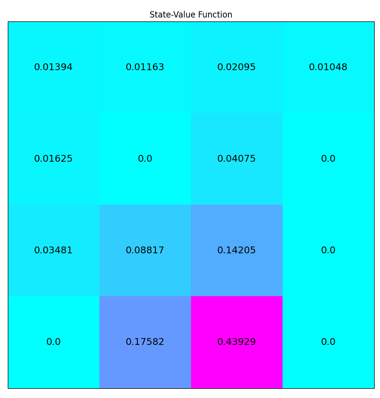

Iterative policy evaluation on ``FrozenLake-v0`` (C++)
=========================================================

In this example, we use the iterative policy iteration algorithm to train an
agent on the ``FrozenLake-v0`` environment. In ``CubeAI`` there is a
tabular implementation of the algorithm implemented in the ``IterativePolicyEvaluator`` class.

Code
----

.. code-block::

	#include "cubeai/base/cubeai_config.h"

	#ifdef USE_GYMFCPP

	#include "cubeai/base/cubeai_types.h"
	#include "cubeai/rl/algorithms/dp/iterative_policy_evaluation.h"
	#include "cubeai/rl/trainers/rl_serial_agent_trainer.h"
	#include "cubeai/rl/policies/uniform_discrete_policy.h"

	#include "gymfcpp/gymfcpp_types.h"
	#include "gymfcpp/frozen_lake_env.h"
	#include "gymfcpp/time_step.h"

	#include <boost/python.hpp>

	#include <iostream>

.. code-block::

	namespace rl_example_6
	{

	using cubeai::real_t;
	using cubeai::uint_t;
	using cubeai::rl::policies::UniformDiscretePolicy;
	using cubeai::rl::algos::dp::IterativePolicyEval;
	using cubeai::rl::algos::dp::IterativePolicyEvalConfig;
	using cubeai::rl::RLSerialAgentTrainer;
	using cubeai::rl::RLSerialTrainerConfig;
	typedef gymfcpp::TimeStep<uint_t> time_step_t;

	}
	
.. code-block::

	int main() {

	    using namespace rl_example_6;

	    Py_Initialize();
	    auto gym_module = boost::python::import("__main__");
	    auto gym_namespace = gym_module.attr("__dict__");

	    gymfcpp::FrozenLake<4> env("v0", gym_namespace);
	    env.make();

	    UniformDiscretePolicy policy(env.n_states(), env.n_actions());
	    IterativePolicyEvalConfig config;
	    config.tolerance = 1.0e-8;

	    IterativePolicyEval<gymfcpp::FrozenLake<4>, UniformDiscretePolicy> algorithm(config, policy);

	    RLSerialTrainerConfig trainer_config = {10, 10000, 1.0e-8};

	    RLSerialAgentTrainer<gymfcpp::FrozenLake<4>, IterativePolicyEval<gymfcpp::FrozenLake<4>,
		    UniformDiscretePolicy>> trainer(trainer_config, algorithm);

	    auto info = trainer.train(env);
	    std::cout<<info<<std::endl;

	    // save the value function for plotting
	    algorithm.save("iterative_policy_evaluation_frozen_lake.csv");

	   return 0;
	}
	#else
	#include <iostream>

	int main() {

	    std::cout<<"This example requires  gymfcpp. Configure cubeai to use gymfcpp"<<std::endl;
	    return 0;
	}
	#endif

Results
-------

.. code-block::

	Episode index........: 0
	Episode iterations...: 16
	Episode reward.......: 3
	Episode time.........: 0.0023441
	Has extra............: false

	Episode index........: 10
	Episode iterations...: 16
	Episode reward.......: 3
	Episode time.........: 0.00178728
	Has extra............: false

	Episode index........: 20
	Episode iterations...: 16
	Episode reward.......: 3
	Episode time.........: 0.00174855
	Has extra............: false

	Episode index........: 30
	Episode iterations...: 16
	Episode reward.......: 3
	Episode time.........: 0.00167018
	Has extra............: false

	Episode index........: 40
	Episode iterations...: 16
	Episode reward.......: 3
	Episode time.........: 0.001637
	Has extra............: false

	Episode index........: 50
	Episode iterations...: 16
	Episode reward.......: 3
	Episode time.........: 0.00200397
	Has extra............: false

	INFO:  Stopping training at index=56
	Converged...: false
	Tolerance...: 1e-08
	Residual....: 1.79769e+308
	Iterations..: 57
	Total time..: 0.103961
	

